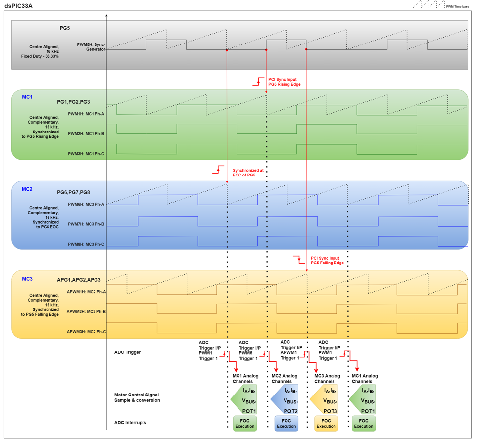
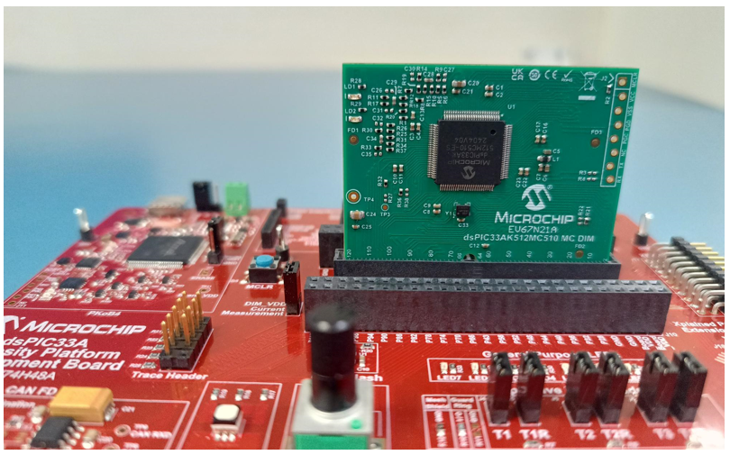
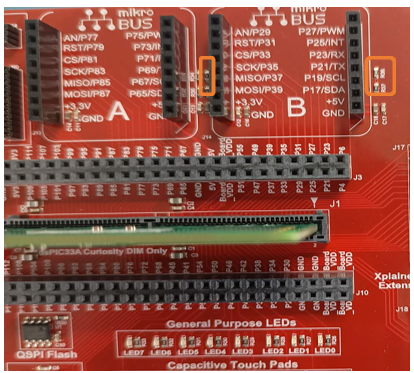
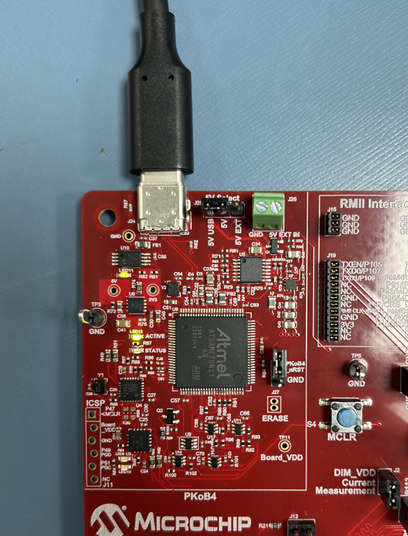
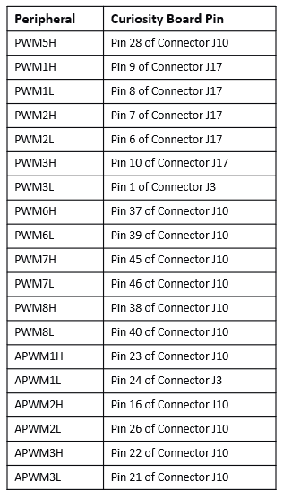
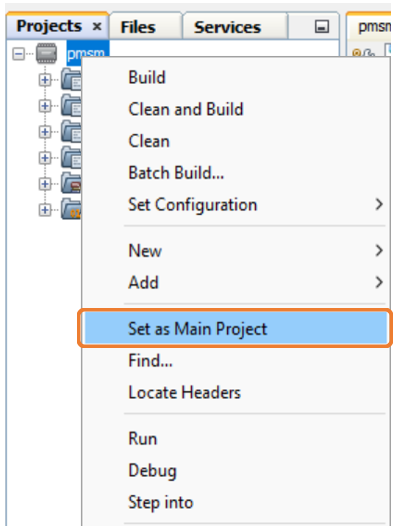
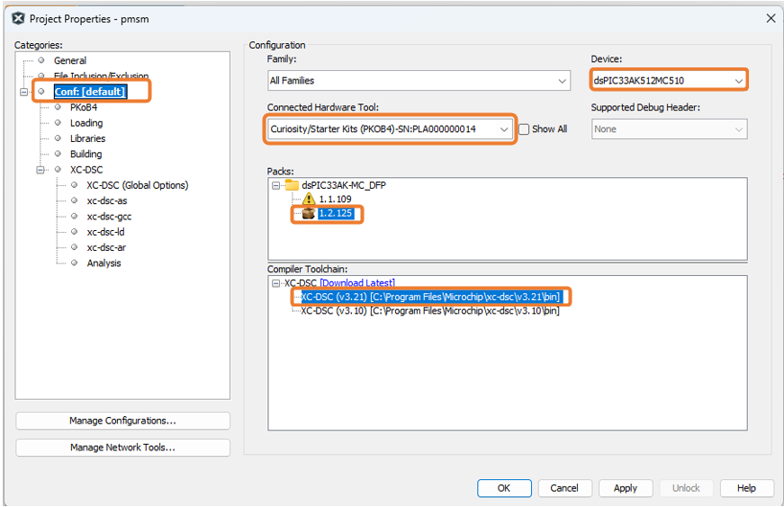
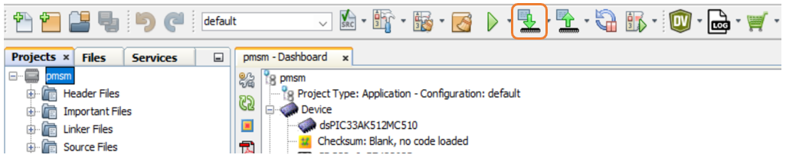
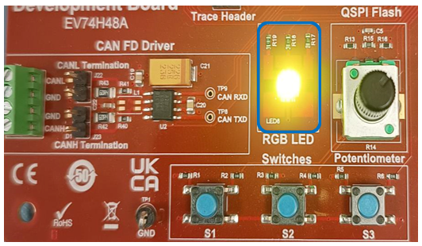
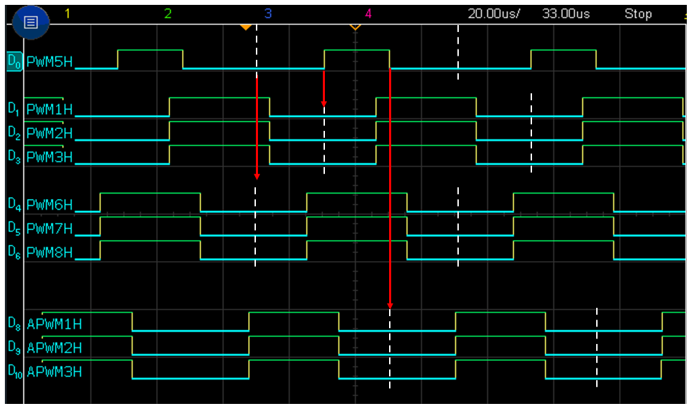

<picture>
    <source media="(prefers-color-scheme: dark)" srcset="images/microchip_logo_white_red.png">
  <source media="(prefers-color-scheme: light)" srcset="images/microchip_logo_black_red.png">
    
</picture> 

# PWM Peripheral Example: 
# PWM Switching Scheme for Triple Motor Control : Curiosity Platform Development Board and dsPIC33AK512MC510 MC DIM.

## 1. INTRODUCTION
This document describes implementation of PWM switching scheme used for the Triple motor control. The example is implemented on [EV74H48A](https://www.microchip.com/en-us/development-tool/ev74h48a) "Curiosity Platform Development Board" and [EV67N21A](https://www.microchip.com/en-us/development-tool/ev67n21a) "dsPIC33AK512MC510 Motor Control Dual In-line Module(DIM)".This example demonstrates the Synchronization feature of the High Resolution PWM module in the dsPIC33A Digital Signal Controllers.

**_NOTE:_**
The [dsPIC33AK512MC510](https://www.microchip.com/en-us/product/dsPIC33AK512MC510) is a Digital Signal Controller (DSC) from Microchip Technology and part of the [dsPIC33AK512MPS512](https://www.microchip.com/en-us/product/dsPIC33AK512MPS512) family, designed for motor control and other high-performance embedded system applications.

The PWM generators are configured to control three three-phase motor control inverters, each independently driving three three-phase motors.  

Synchronization helps in :

- Best utilization of ADC cores.
- Staggers the interrupts for executing motor control algorithms. 
- Allows selective sampling to minimize noise in the measured signals due to switching transients of other converters.
- Distributes switching noise across the cycle, compared to peak noise produced if all converters were turned on simultaneously.  

### 1.1 PWM Switching Scheme  

- The PWM generator PG5 is dedicated to synchronization, and its output is not used for controlling the converter or inverter in this example.PG5 is configured in centre-aligned mode with a 33.33% duty cycle.  
- The PWM generators PG1 to PG3 are configured to control three-phase motor control inverter MC1, Auxiliary PWM genrators APG1 to APG3 are used for the secondd three-phase motor control inverter(MC2) and PG6 to PG8 are used for the third three-phase motor control inverter(MC3).  All the PWM generators operates at 16kHz.
- PG1 to PG3 is synchronized to the rising edge of PG5 output, PG6- PG8 are synchronized to the End of Cycle (EOC) of PG5 and APG1 to APG3 are synchronized to the falling edge of PG5 output through PCI Sync feature of the PWM, thus interleaving operation of MC1,MC2 and MC3 for optimal utilization of the controller resources.
- The figure below depicts the PWM generation for MC1,MC2 and MC3. Also, PG5 is utilized to synchronize the PWMs to interleave the PWM generators for controlling the motors.

  

  

## 2.	SUGGESTED DEMONSTRATION REQUIREMENTS
### 2.1 Application Example Firmware Required for the Demonstration
To clone or download this application firmware on GitHub, 
- Navigate to the [main page of this repository](https://github.com/microchip-pic-avr-examples/curiosity-33ak512mc510-pwmexample-triple-motor-control) and 
- On the tab **<> Code**, above the list of files in the right-hand corner, click Code, then from the menu, click **Download ZIP** or copy the repository URL to **clone.**

### 2.2	Software Tools Used for Testing the firmware
- MPLAB® X IDE **v6.25** 
- MPLAB® XC-DSC Compiler **v3.21**
- DFP: **dsPIC33AK-MC_DFP v1.2.125**

> **_NOTE:_**
>The software used to test the code example during release is listed above. It is recommended, to build the code example using the tool version listed above or later.

### 2.3	Hardware Tools Required for the Demonstration
- Curiosity Platform Development Board ([EV74H48A](https://www.microchip.com/en-us/development-tool/EV74H48A))
- dsPIC33AK512MC510 Motor Control Dual In-Line Module ([EV67N21A](https://www.microchip.com/en-us/development-tool/ev67n21a))

> **_NOTE:_**
>All items listed under this section Hardware Tools Required for the Demonstration are available at [microchip DIRECT](https://www.microchipdirect.com/).

## 3. HARDWARE SETUP
This section describes the hardware setup required for the demonstration.
> **Note:**  
>In this document, hereinafter Curiosity Platform Development Board is referred as **development board**.

1. Insert the **dsPIC33AK512MC510 MC DIM** into the DIM Interface **connector J1** on the development board. Make sure the DIM is placed correctly and oriented before going ahead.

     

     

2. Remove the resistors **R36**,**R37** and **R38** from the development board.
     

     
     

3. The development board has an onboard programmer **PICkit™ On Board (PKoBv4)** , which can be used for programming or debugging the microcontroller or dsPIC DSC on the DIM. To use the onboard programmer, connect a micro-USB cable between the Host PC and **connector J24** on the development board.

    This USB also powers the development board.

      

     

4. PWM signals can be monitored using the oscilloscope. Refer to the following table for the signal mapping.
      

     

## 4.	BASIC DEMONSTRATION
### 4.1 Firmware Description
The firmware version needed for the demonstration is mentioned in the section [Application Example Firmware Required for the Demonstration](#21-application-example-firmware-required-for-the-demonstration) section. This firmware is implemented to work on Microchip’s Digital Signal Controller (dsPIC® DSC) **dsPIC33AK512MC510**. For more information, see the **dsPIC33AK512MPS512 Family datasheet [(DS70005591)](https://ww1.microchip.com/downloads/aemDocuments/documents/MCU16/ProductDocuments/DataSheets/dsPIC33AK512MPS512-Family-Data-Sheet-DS70005591.pdf)**.

### 4.2 Basic Demonstration

 Follow the instructions step-by-step, to set up and run the demo example:

1. Start **MPLAB X IDE** and open the project **pmsm.X (File > Open Project)** with device selection **dsPIC33AK512MC510.**  
    

       

  

2. Set the project **pmsm.X** as the main project by right clicking on the project name and selecting **Set as Main Project** as shown. The project **pmsm.X** will then appear in **bold.**
    

     

3. Right-click on the main project **pmsm.X** and select **Properties** to open its **Project Properties** Dialog. Click the **Conf:[default]** category to reveal the general project configuration information. The development tools used for testing the firmware are listed in section [2.2 Software Tools Used for Testing the firmware.](#22-software-tools-used-for-testing-the-firmware).

     In the **Conf:[default]** category window: 
     - Ensure the selected **Device** is **dsPIC33AK512MC510.**
     - Select the **Connected Hardware Tool** to be used for programming and debugging. 
     - Select the specific Device Family Pack (DFP) from the available list of **Packs.** In this case, **dsPIC33AK-MC_DFP 1.2.125** is selected. 
    - Select the specific **Compiler Toolchain** from the available list of **XC-DSC** compilers. 
     In this case, **XC-DSC(v3.21)** is selected.
     - After selecting Hardware Tool and Compiler Toolchain, Device Pack, click the button **Apply**.

     Please ensure that the selected MPLAB® XC-DSC Compiler and Device Pack support the device configured in the firmware.

     

     

4. To build the project (in this case, **pmsm.X**) and program the device dsPIC33AK512MC510, click **Make and Program Device Main project** on the toolbar.

    

    

  
5. If the device is successfully programmed, **RGB LED** will be turned **ON**, indicating that the dsPIC® DSC is enabled.
    

     

6. Monitor the PWM signal through oscilloscope as shown below : 
     

     

## 	5. REFERENCES:
For more information, refer to the following documents or links.
1. Curiosity Platform Development Board User's Guide ([DS70005562](https://ww1.microchip.com/downloads/aemDocuments/documents/MCU16/ProductDocuments/UserGuides/Curiosity-Platform-Development-Board-Users-Guide-DS70005562.pdf))
2. dsPIC33AK512MC510 Motor Control Dual In-Line Module (DIM) Information Sheet ([DS70005553](https://ww1.microchip.com/downloads/aemDocuments/documents/MCU16/ProductDocuments/InformationSheet/dsPIC33AK512MC510-Motor-Control-Dual-In-Line-Module-Information-Sheet-DS70005553.pdf))
3. dsPIC33AK512MC510 Family datasheet ([DS70005591](https://ww1.microchip.com/downloads/aemDocuments/documents/MCU16/ProductDocuments/DataSheets/dsPIC33AK512MPS512-Family-Data-Sheet-DS70005591.pdf))
4. MPLAB® X IDE User’s Guide ([DS50002027](https://ww1.microchip.com/downloads/en/DeviceDoc/50002027E.pdf)) or [MPLAB® X IDE help](https://microchipdeveloper.com/xwiki/bin/view/software-tools/x/)
5. [MPLAB® X IDE installation](http://microchipdeveloper.com/mplabx:installation)
6. [MPLAB® XC-DSC Compiler installation](https://developerhelp.microchip.com/xwiki/bin/view/software-tools/xc-dsc/install/)
7. [Microchip Packs Repository](https://packs.download.microchip.com/)